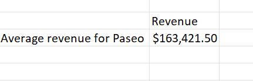
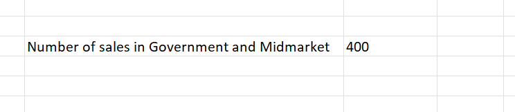
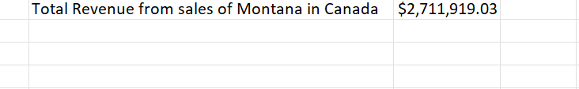
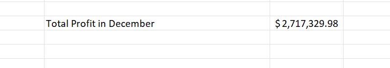

# Analysis of an International Store Sales Data

## Introduction 

This is an excel project on the sales data of a company. The aim is to analyze the data to gain insight into the revenue and profit of the company specific to months, product and country. 
**_Disclaimer_**: This project does not represent the interest of any company, institutions or country.

## Problem Statement 

What is the average revenue generated from each sale of ‘Paseo’? 

What is the number of sales made in the Government and Midmarket segment? 

What is the total revenue generated from sales of ‘Montana’ in Canada? 
 
What is the total profit made in December? 

## Skills Demonstrated 

- Data transformation
- Data sorting 
- Use of complex Excel functions

## Data Sourcing

This sales data was provided to me by my tutor to work with. 

## Data Transformation 

The data was transformed with data in each column reformatted to the data type that fits their respective contents. 

## Analysis 
#### What is the average revenue generated from each sale of ‘Paseo’? 

The average revenue generated from the sale of Paseo by the company was calculated using the AVERAGEIF function in Excel and the result is shown in the image below. 

#### What is the number of sales made in the Government and Midmarket segment? 

The number of sales made in the Government and Midmarket segment was calculated using the COUNTIF function in Excel. The result is highlighted in the image below. 

#### What is the total revenue generated from sales of ‘Montana’ in Canada? 

The total revenue generated from the sales of Montana in Canada was calculated using the SUMIFS function in Excel. The result is shown below in the image. 

#### What is the total profit made in December? 

The total profit made in December was calculated using the SUMIF function in Excel. The result is shown in the image below. 

## Conclusion

This analysis was able to show the revenue and profit of the International Store with respect to some of their products; Paseo and Montana, country; Canada and month; December. This will help the store to make a better decision rearding their sales and profit. 
